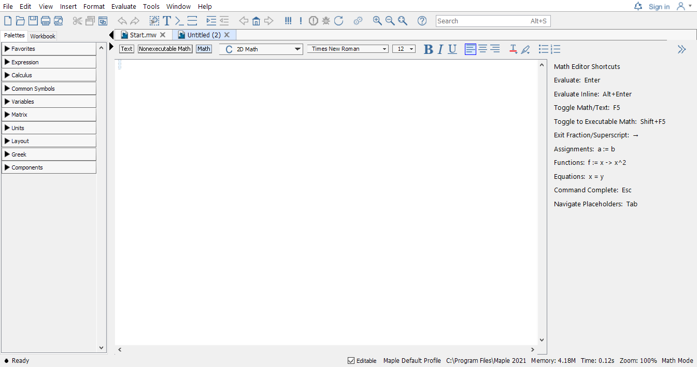
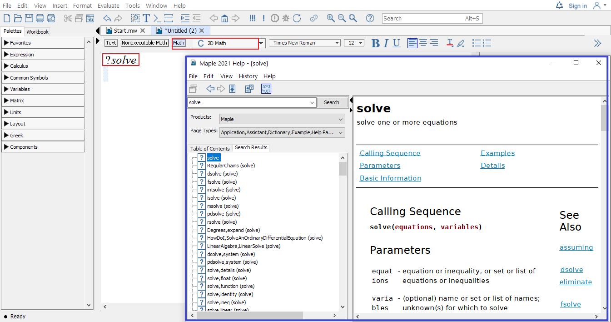

# Basics in Maple

## Getting Started

When Maple (say Maple2021) starts, you will see the following Maple Start document.

{width=90%}

- If you already know what you want to do, then you may open a new document by clicking **New Document** icon in the start document. The following shows what an new (empty document) looks like.
  
  {width=90%}

  - In the context bar of this new document, the current mode is indicated.

    {width=50%}

  - Initially, the Text mode is in use. You may switch to another mode by clicking one of the three modes: Text, Nonexecutable math, or Math.

  - Alternatively, you may use the **F5** shortcut key, to toggle between these three modes in sequence: text entry, nonexecutable math entry, and executable math.

- If you want to explore some featured sample documents, you may go to **Start.mw** document and click on different icons to open a new document.

  - You may alway reopen the start page by click the home icon {width=1.5em} located in the Toolbar to reopen the start page.

- To seek help in Maple is easy, in the Math mode, type in the keywords after the question mark `?` and press **ENTER**, you will see a new window popping out with searched results.

  - For example, typing in `?solve` and pressing **ENTER** will open the following window.
    {width=50%}

::: {.remark}  

1. Using the **ENTER** key, the result will appear in the next line.

2. To get the result in the SAME line, you may use **ALT+ENTER**.
:::

## Basic Operators

Use the command `?operators`, you may find descriptions of arithmetic operators in Maple.

| | addition | subtraction | multiplication | division | exponentiation |
|:---:|:---:|:---:|:---:|:---:|:---:|
| Maple Operators | `+` | `-` | `*` | `/` | `^` |
| In writing | $x+2$ | $a-b$ | $2x$ | $\dfrac pq$ | $b^5$ |
| In Maple| `x+2` | `a-b` | `2*x` | `p/q` | `b^5` |

Among all operators in Maple, we will frequently use the assignment operator `:=`. You will see examples in the next section.

## Variables

Variables in Maple can be defined using combinations of letters, digits, and underscores, but not beginning with a digit. For example, we frequently use letters as well as letters followed by a number as variable names. Words connected by underscores are also frequently used as variable names.

Note that there are reserved combinations. Those combinations are not allowed in Maple. For example, if you use `sin` as a variable name and try to assign 1 to it using the command `sin:=1`. You will see the following error message

::: {.error style="color:blue; text-decoration: underline; font-style:italic; padding: 0 2em;"}
Error, attempting to assign to `sin` which is protected.  Try declaring `local sin`; see ?protect for details.
:::

## How to define a function

A function is an assignment, for a given input $x$, we assignment an output $y$ under a certain rule. Maple takes this idea to define functions.

```
function name:= independent variable -> function rule
```

Here `:=` means "defined/assigned to be" and the arrow operator `->` may be understood as "plug in".

::: {.rmdnote}  

1. The assignment operator `:=` to the left-hand side the value of the right-hand side. The left-hand side normally is a name and the right-hand side is a value or expression.

2. As far as I know, starting from Maple 2019, one can also define a function using the syntax:
  
  ```
  functionname(independent variable) := expression
  ```
:::

::: {.example}

Define the following function in Maple and find the value $f(0.999)$.
$$f(x)=\dfrac{x}{x-1}$$

:::

::: {.solution}
The function name is $f$, the independent variable is $x$ and the function rule is $\dfrac{x}{x-1}$. So the function can be defined in Maple by the following command.

```
f:=x->x/(x-1)
```

Once the function is define, you may find the function value using the following the command. 

```  
f(0.999)
```

:::

::: {.exercise}

Define the following function in Maple and find the value $f(2.0001)$.

$$
g(x)=\dfrac{x^3}{(x-2)^2}
$$

:::

## Initially known mathematical functions

Maple has many predefined functions which can be used to create new functions. To see all initially known mathematical functions in maple, you may use the help command `?functions` and click the hyperlinked "initial functions" in the description shown in the new window.

{width=80%}

Some frequently used functions are listed in tables below.

| absolute value | square root | n-th root  | natural exponential | logarithmic                |
|:--------------:|:-----------:|:----------:|:-------------------:|:--------------------------:|
| `abs()`        | `sqrt()`    | `surd(,n)` | `exp()`             | `log()`,`log[b]()`, `ln()` |

| sine    | cosine  | tangent | cotangent | secant  | cosecant |
|:-------:|:-------:|:-------:|:---------:|:-------:|:--------:|
| `sin()` | `cos()` | `tan()` | `cot()`   | `sec()` | `csc()`  |

| inverse sine | inverse cosine | inverse tangent | inverse cotangent | inverse secant | inverse cosecant |
|:-------:|:-------:|:-------:|:---------:|:-------:|:--------:|
| `arcsin()`   | `arccos()`     | `arctan()`      | `arccot()`        | `arcsec()`     | `arccsc()`       |

## Plot functions

In Maple, you may plot a single variable function easily using the command

```

plot(expression, domain, options)

```

or plot several single variable functions together using

```

plot([experssion1, experssion2], domain, options)

```

In the command, options may be omitted, but the domain must be given.
To see details about available options, you may run the command `?plot` in Maple.

::: {.example}

Plot the functions $f(x)=x^2$ in red and $l(x)=2x+1$ in blue over the domain $[-1, 2]$.

:::

::: {.solution}

Here are the command and the output

    plot([x^2, 2*x+1], x=-1..2, color=[red, blue])

{width=50%}

:::

::: {.exercise}

Plot the piecewise function in Exercise \@ref(exr:piecewise-exer1) over the domain $[-2, 4]$.

:::

::: {.exercise}

Plot the functions $f(x)=\ln(x+5)$ and $g(x)=3\cos(2x+1)+4$ over the domain $[-\pi, \pi]$.

:::
