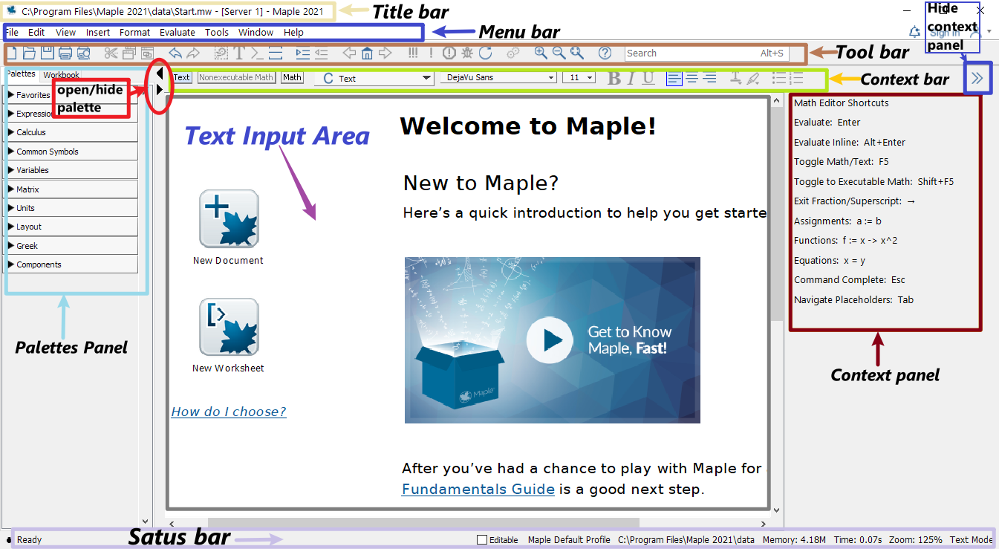
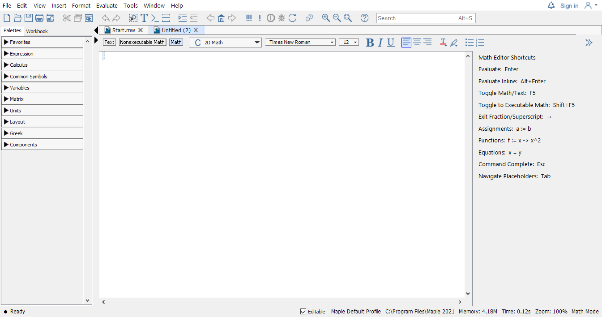
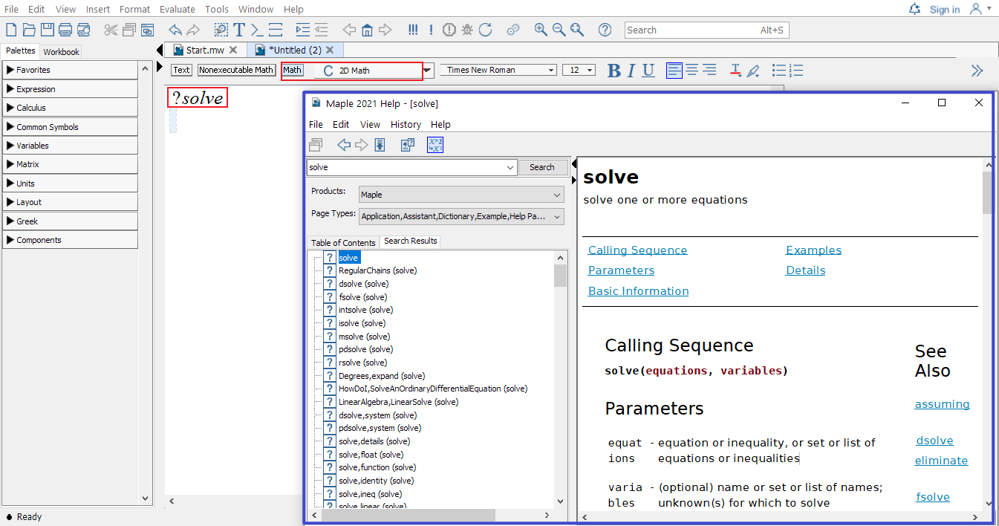
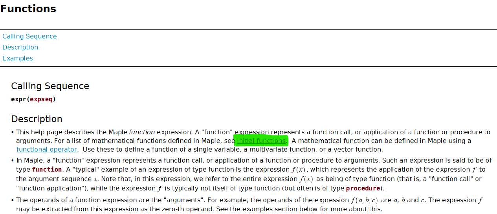
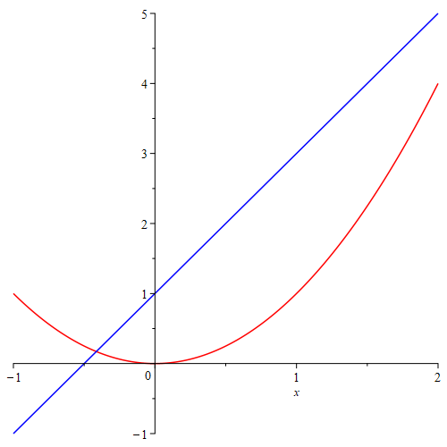
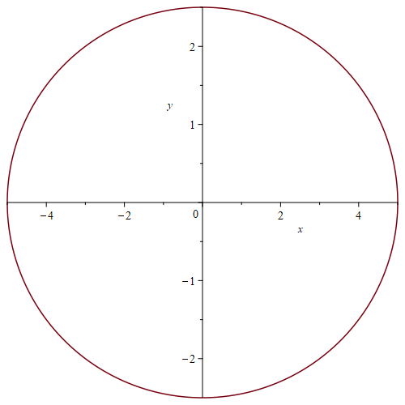
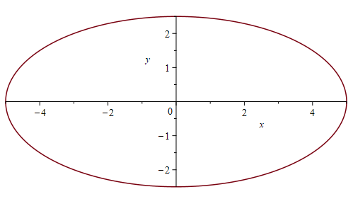

# Basics in Maple

## Getting Started

When Maple (say Maple2021) starts, you will see the following Maple Start document.

{width=90%}

- The palettes of Maple found on the left side of the Maple window contains expressions and
symbols that you can used to quickly entry them.

- The context panel of Maple found on the right side of the Maple window can be used to perform a wide variety of operations on an expression or its output.

If you already know what you want to do, then you may open a new document by clicking **New Document** icon in the start document. The following shows what an new (empty document) looks like.
  
{width=90%}

- In the context bar of this new document, the current mode is indicated.

  {width=50%}

- Initially, the Text mode is in use. You may switch to another mode by clicking one of the three modes: Text, Nonexecutable math, or Math.

- Alternatively, you may use the **F5** shortcut key, to toggle between these three modes in sequence: text entry, nonexecutable math entry, and executable math.

If you want to explore some featured sample documents, you may go to **Start.mw** document and click on different icons to open a new document.

- You may alway reopen the start page by click the home icon {width=1.5em} located in the Toolbar to reopen the start page.

To seek help in Maple is easy, in the Math mode, type in the keywords after the question mark `?` and press **ENTER**, you will see a new window popping out with searched results.

- For example, typing in `?solve` and pressing **ENTER** will open the following window.

  {width=50%}

::: {.rmdnote}  

1. Using the **ENTER** key, the result will appear in the next line.

2. To get the result in the SAME line, you may use **ALT+ENTER**.
:::

In the coming sections, some basics of Maple will be introduced. Another good place to start learning maple is the [Maple Quick Reference Card](https://www.maplesoft.com/support/help/Maple/view.aspx?path=worksheet/help/usingquickreference&cid=36).

## Operators, Variables, and Delimiters

### Basic Operators

Use the command `?operators`, you may find descriptions of arithmetic operators in Maple.

| | addition | subtraction | multiplication | division | exponentiation |
|:---:|:---:|:---:|:---:|:---:|:---:|
| Maple Operators | `+` | `-` | `*` | `/` | `^` |
| In writing | $x+2$ | $a-b$ | $2x$ | $\dfrac pq$ | $b^5$ |
| In Maple| `x+2` | `a-b` | `2*x` | `p/q` | `b^5` |

::: {.rmdnote}

In the case of a number multiplied by a variable, the multiplication symbol may be omitted. In general, you can use `*` or a `[space]` to denote multiplication. However, it's highly recommended to use `*` which is easier to debug.

:::

Among all operators in Maple, we will frequently use the assignment operator `:=`. You will see examples in the next section.

### Variables

Variables in Maple can be defined using combinations of letters, digits, and underscores, but not beginning with a digit. For example, we frequently use letters as well as letters followed by a number as variable names. Words connected by underscores are also frequently used as variable names.

Note that there are reserved combinations. Those combinations are not allowed in Maple. For example, if you use `sin` as a variable name and try to assign 1 to it using the command `sin:=1`. You will see the following error message

$$
\color{blue}{
  \begin{aligned}
  &\text{Error, attempting to assign to `sin` which is protected.}\\
  &\text{Try declaring `local sin`; see ?protect for details.}
  \end{aligned}
  }
$$

However, you will find that `sinx` is a valid variable name. If you assign 1 to it using the command `sinx:=1`. Pressing ENTER, you will get

$$\color{blue}{sinx := 1}.$$

Sometime you may want to clear the value assigned to a variable. To do so, one way is to assign to the variable its own name:

```
sinx:='sinx'
```

Another way is to use the unassign command `unassign()`:

```
x:=1;
unassign('x');
```

If you would like to forget all previous commands and results, the `restart` command can be used to clear Maple's memory so that it will act (almost) as if just started.

::: {.exercise}

Define a variable, assign a number to it, then clear the value assigned to it.

:::

### Delimiters

In Maple, commands or functions obey the function notation: `FunctionName()`. Note that there should be no space between the command/function and the parentheses `()`. For example, `unassign(f)` is valid but `unassign (f)` is not.

Square brackets `[,]` can be used to enclose a list of ordered objects. They can also be used for subscripts. For example, you may define a order list `v` and use `v[1]` to get the first value. Square brackets sometime are also used for options of commands.

Curly brackets `{,}` are used to enclose sets of objects whose order is unimportant.

Triangle brackets `<,>` or `<|>` can be used to create column or row vectors, or matrices.

Examples of usage of above mentioned delimiters can be found in later sections.

### Statement Separator

In Maple you may use the semicolon (`;`) and the colon (`:`) to end a statement.

- The semicolon is the normal statement separator.
- When using the colon, the statement will be executed but the result of the statement will not be displayed.
- Statement separator may be omitted if there is only one statement in a single line.

:::: {.example}

Entering the following commands will only display the values of $b$, $c$ and $d$ but not $a$

```
a := 1:
b := a+1; c:=b+1;
d := c+1
```

::::

::: {.exercise}

Define a variable and assign a value to it without display the result. Add the value 1 to the variable and display the result.

:::

## Functions and Evaluation

### How to define a function

A function is an assignment, for a given input $x$, we assignment an output $y$ under a certain rule. Maple takes this idea to define functions.

```
function name:= independent variable -> function rule
```

Here `:=` means "defined/assigned to be" and the arrow operator `->` may be understood as "plug in".

Another way to define a function is using the function notation as follows

  ```
  functionname(independent variable) := expression
  ```

Note that this feature only available in Maple 10 or a later version.

Yet another uncommon, but useful way to define a function is to use the command `unapply`. This command turns an expression into an operator.

::: {.example}

Define the following function in Maple and find the value $f(0.999)$.
$$f(x)=\dfrac{x}{x-1}$$

:::

::: {.solution}
The function name is $f$, the independent variable is $x$ and the function rule is $\dfrac{x}{x-1}$. So the function can be defined using one of the following methods.

- Method 1:  

  ```
  f:=x->x/(x-1)
  ```

- Method 2:

  ```
  f(x):=x/(x-1)
  ```

- Method 3:

  ```
  f:=unapply(x/(x-1), x)
  ```

Once the function is define, you may find the function value using the following the command.

```  
f(0.999)
```

:::

::: {.exercise}

Define the following function in Maple and find the value $f(2.0001)$.

$$g(x)=\dfrac{x^3}{(x-2)^2}$$

:::

### Initially known mathematical functions

Maple has many predefined functions which can be used to create new functions. To see all initially known mathematical functions in maple, you may use the help command `?functions` and click the hyperlinked "initial functions" in the description shown in the new window.

{width=80%}

Some frequently used functions are listed in tables below.

| absolute value | square root | n-th root  | natural exponential | logarithmic                |
|:--------------:|:-----------:|:----------:|:-------------------:|:--------------------------:|
| `abs()`        | `sqrt()`    | `surd(,n)` | `exp()`             | `log()`,`log[b]()`, `ln()` |

| sine    | cosine  | tangent | cotangent | secant  | cosecant |
|:-------:|:-------:|:-------:|:---------:|:-------:|:--------:|
| `sin()` | `cos()` | `tan()` | `cot()`   | `sec()` | `csc()`  |

| inverse sine | inverse cosine | inverse tangent | inverse cotangent | inverse secant | inverse cosecant |
|:-------:|:-------:|:-------:|:---------:|:-------:|:--------:|
| `arcsin()`   | `arccos()`     | `arctan()`      | `arccot()`        | `arcsec()`     | `arccsc()`       |

### Evaluation and Substitution

To evaluate an expression with given values for the variables, there are multiple approaches.

- The `subs` command.

- Define a function using the expression and evaluate it using the function notation. For example, you may find the value of $e^{1.2}$ using the command `exp(1.2)`. Here `exp()` is the exponential function with the base $e$.

::: {.example}
The following codes show how to evaluate an expression using the `subs` command.

```
f:=a*x^2+b*x+c;
g:=subs({a=1, b=2, c=3}, f);
h:=subs(x=1, g);
```

:::

::: {.example}

The following codes show how to evaluate an expression using the functional approach.

```
f := x -> x^2 + 2*x + 3;
f(1/2);
```

:::

To evaluates expressions numerically, you need apply the command `evalf`. To keep only $n$ digits in total, you may use `evalf[n]` or `evalf( , n)`.

::: {.example}

The command `evalf(sqrt(2))` will return the numerical value 1.414213562 of $\sqrt{2}$.
The command `evalf[5](Pi)` will return the numerical value 3.1416 of $\pi$.

:::

::: {.rmdnote}

1. In Maple, the name `Pi` is for calculation. But the name `pi`, where `p` is in lower case, is for the mathematical constant $\pi$. You will see the difference when evaluating `sin(Pi)` and `sin(pi)`.

2. In Maple, to keep $n$ decimal places of number, you may use `floor()+evalf[3](frac())`.

:::

::: {.exercise}

Evaluate the expression $\sin(x)-2x^2-1$ at $x=\pi$ and find the numerical value of the result.

:::

## Packages and Plotting

### Frequently used packages and how to load them

A package is a collection of commands that extends the basic functionality of Maple and provided tools for solving problems of certain type or in certain field.

The package `Student` contains subpackages designed for learning of standard undergraduate mathematics courses, such as Calculus, Linear Algebra, Ordinary Differential Equations.

A few useful packages for differential equations are `Student[ODEs]`, `DETools` and `Plots`.

Packages can be loaded from the Menu bar or using the command `with()`. For example, the follows commands will load the above mentioned three packages without display the available commands of each package.

```
with(Student[ODEs]): with(DETools): with(plots):
```

Note that you may use the semicolon separator to see possible commands supported by a package.

### Plot explicit functions

In Maple, you may plot a single variable function easily using the command

```
plot(expression, range, options)
```

or plot several single variable functions together using

```
plot([experssion1, experssion2], range, options)
```

In the command, options may be omitted, but the range must be given. A range of values for a variable in Maple has the form `x = a..b`, where $a$ and $b$ are the left and the right ends of the interval $[a, b]$ for $x$. For example, if the range `x = 0..5` is given, the graph will be only plotted over the domain $[0, 5]$ for the function.

To see details about available options, you may run the command `?plot` in Maple.

::: {.example}

Plot the functions $f(x)=x^2$ in red and $l(x)=2x+1$ in blue over the domain $[-1, 2]$.

:::

::: {.solution}

Use the `plot` command to create graphs.

```
plot([x^2, 2*x+1], x=-1..2, color=[red, blue])
```

The output is shown below.

{width=50%}

The red curve is the graph of $y=x^2$. The blue curve is the graph of $y=2x+1$.

:::

In this example, we used square brackets to order lists of functions and colors so that a function is paired with a color in the given order.

::: {.exercise}

Plot the functions $f(x)=\ln(x+5)$ and $g(x)=3\cos(2x+1)+4$ over the domain $[-\pi, \pi]$.

:::

### Plot implicit functions

To plot the curve of implicit functions defined by equations, we need the command `implicitplot` which is supported by the package `plots`. The usage of `implicitplot` is similar to the commands `plot`. Indeed, there share many common options. For details, you can run the command `?implicitplot`.

::: {.example}

Plot the curve defined by $x^2+4y^2=25$ in the region where $-5\le x\le 5$ and $-3\le y\le 3$.

:::

::: {.solution}

After loading the package, we may use this command to plot the graph.

```
with(plots):
implicitplot(x^2+4*y^2=25, x=-5..5, y=-3..3);
```

The output is the following graph.

{width=50%}

You will find the the graph looks a circle instead of a ellipse that the equation defined. This is because, the $x$-axis and $y$-axis are not in the same scaling. To have the same scaling, we need to add the option `scaling = constrained`.

```
implicitplot(x^2+4*y^2=25, x=-5..5, y=-3..3, scaling = constrained);
```

Here is the output:

{width=50%}

Now the graph is in equally scaled coordinates.

:::

::: {.exercise}

Plot the curve defined by $x^2-4y^2=9$ in the equally scaled region: $-5\le x\le 5$ and $-3\le y\le 3$.

:::

## Differentiation and Integration

- The `int(f(x), x)` calling sequence computes an indefinite integral $\int f(x) \mathrm{d} x$. The `int(f(x), x=a..b)` calling sequence computes an indefinite integral $\int_a^b f(x) \mathrm{d} x$.

- The `diff` command computes the partial derivative of the expression a with respect to $x_1$, $x_2$, ..., $x_n$, respectively. The most frequent use is `diff(y(x),x)`, which computes the derivative $\frac{\mathrm{d} y}{\mathrm{d} x}$.

- The `implicitdiff(f(x,y)=g(x, y), y, x)` calling sequence computes the derivative $\frac{\mathrm{d} y}{\mathrm{d} x}$ using the implicit differentiation method.

- The differential operator `D` in maple applies to a function and returns a first order (partial) derivative as a function. For example, given a function $y=f(x, y)$, the command `D[1](f)` returns the partial derivative $\frac{\partial}{\partial x}f$.

- In Maple (version >=10), the prime derivative notation also works. For example, given a function `f(x):= sin(x^2)`, the second derivative of $f$ can be calculated using the command `f''(x)`. When applying the prime derivative notation to a function or an expression, the result is in the same type. The default differentiation variable for the prime notation is $x$. To change it the another variable, say $t$, you may use the following command
  
  ```
  Typesetting:-Settings(prime = t) 
  # Change the default differentiation variable to t.
  ```

  Here, the symbol `#` is the comment symbol in Maple.
  
When using `diff` or the prime derivative notation to an expression, the result is an expression. To evaluate it, you may use the `subs` command. Another way is to apply `unapply` to the result to convert it into a function (operator).

::: {.example}

Find $f''(2)$ for the function $f(x)=\sin(x-1)$.

:::

::: {.solution}

We first define a function $f$.

```
f(x):=sin(x-1)
```

To calculate the value of the second derivative $f''(2)$$, the easiest way probably is to use the prime notation.

```
f''(2)
```

If you used `diff` to find the derivative, you may run the following command to get the value $f''(2)$

```
unapply(diff(f(x), x$2), x)(2)
```

Using the command `D`, you may use the following command

```
D(D(f))(2) # D^((2))(f)(2)
```

:::

In this example, the sequence operator `$` is used. The command `x$2` is equivalent to `x, x`.

::: {.exercise}

Use above commands to solve the following problems.

1. Find the indefinite integral of the function $\frac1x$.
2. Find the first derivative of the function $\arctan(x)$.
3. Find $\frac{\mathrm{d} y}{\mathrm{d} x}$, where $x$ and $y$ satisfy the equation $x^2-4y^2=9$.

:::
